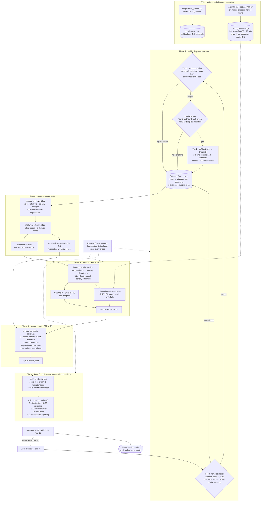
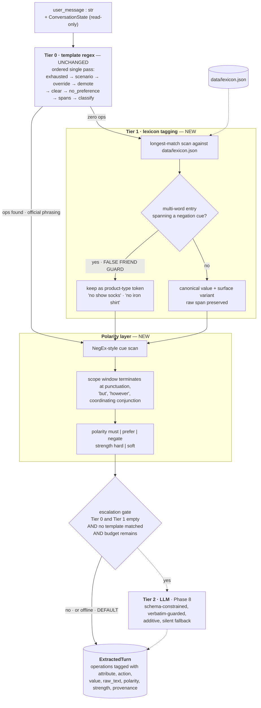
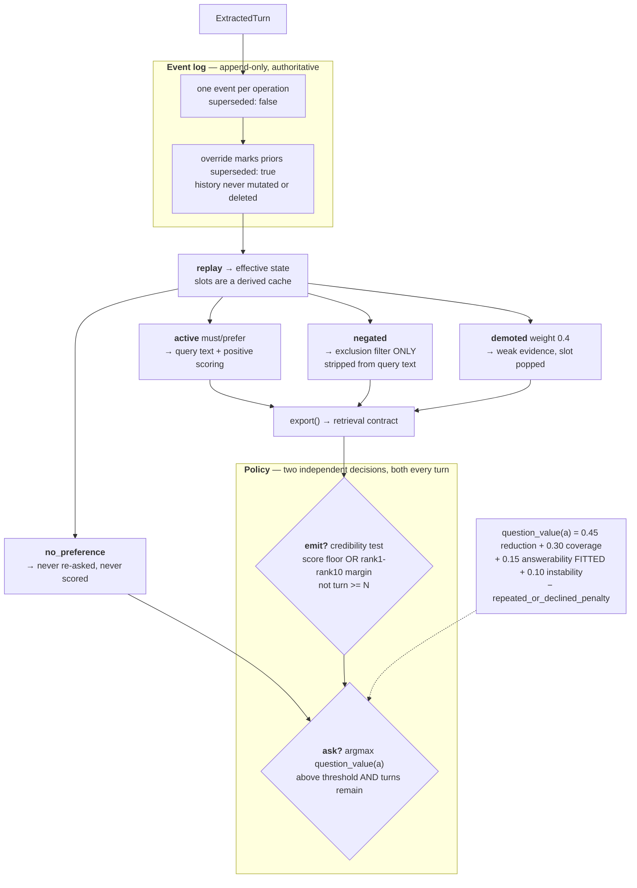
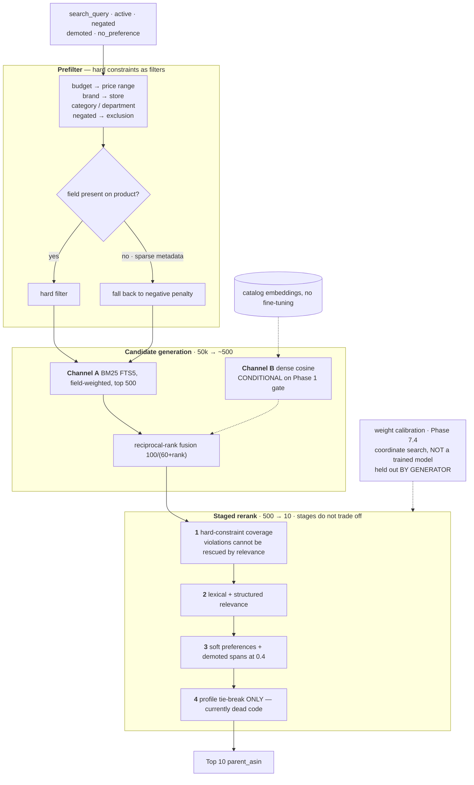
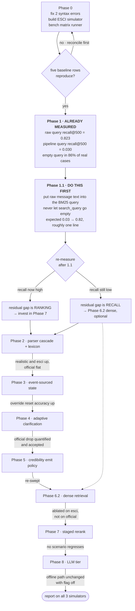
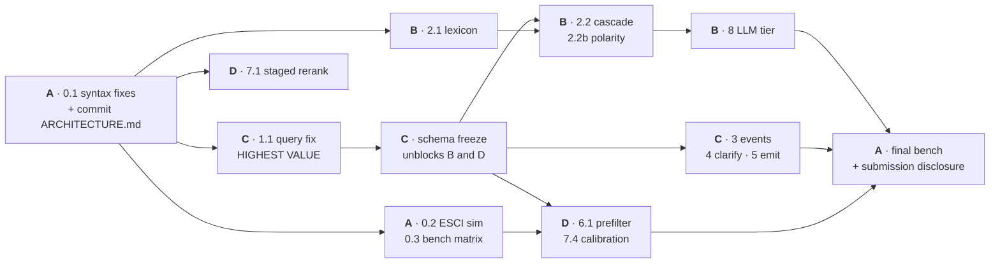

# Implementation plan — robustness-first conversational retrieval

## Context

TikTok TechJam 2026 Track 4. The team has locked twelve architecture decisions
(`Techjam Shopper Research.md`) and chosen the **robustness-first** track:
accept a measured score cost on the official simulator in exchange for a system
that survives paraphrased and real shopper queries.

What the measurements say, from this repo:

| Run | Phrasing | HR@10 | Technical |
|---|---|---|---|
| public 200 | official templates | 0.980 | 0.889 |
| synth 800 | official templates | 0.859 | 0.738 |
| esci 1000 | official templates | 0.839 | 0.723 |
| synth 800 | paraphrased | 0.238 | 0.193 |
| esci 1000 | real ESCI queries | 0.054 | 0.042 |

Weak BM25 baseline is 0.107. The collapse is caused by customer phrasing, not
unreachable targets — all 1000 ESCI targets are in the frozen catalog, and both
ESCI runs use identical sample sets. The official simulator has the customer
recite the target's own listing metadata verbatim; real shoppers do not.

Robustness-first means the 0.19 and 0.04 columns are the primary objective and
the 0.89 is the constraint to not destroy.

Two decisions were adjusted against evidence and are folded in below:
`hold_until_turn` stays a measured parameter rather than a fixed turn-1 rule
(Decision 6), and the clarification formula is built as specified but its
`answerability` weight is fitted from measurement rather than guessed
(Decision 7).

## Hard constraints from the competition spec

- `docs/competition_specification.md:13` puts **full-model training** and
  **infrastructure-heavy vector databases** out of scope. Dense retrieval must
  therefore be a pretrained encoder with brute-force local similarity — 50k ×
  384 float32 is ~77 MB, trivially in-memory. No vector DB, no fine-tuning.
- `docs/submission_rules.md` warns scoring may run **without network**. The
  deterministic path must produce a full score with the LLM tier disabled.
- Model choice, token usage, cost and latency must be disclosed. `last_usage`
  plumbing already exists in `state/llm_extractor.py` and `starter/agent.py`.

Consequence: **do not train a learning-to-rank reranker.** It is out of scope,
and training on simulator-generated labels reproduces the exact overfit the team
is trying to escape. Keep hand-tuned constraint weights.

---

## Target architecture

Phase tags show which build step delivers each block. Dotted edges are
conditional — either gated on a measurement or inactive when running offline.



Everything except the dotted Tier 2 path runs with no network, satisfying the
offline-scoring requirement.

### Worked example — tier routing

Two messages through the same pipeline, showing what the cascade actually does:

| | Official phrasing | Real query |
|---|---|---|
| input | `I'm looking for hiking boots. A key requirement is: 100% Leather.` | `waterproof hiking boots without laces under $120` |
| Tier 0 | matches `key requirement is:` → 2 spans | no template match → **empty** |
| Tier 1 | not reached | lexicon hits: `waterproof`, `boots` |
| polarity | none | `without laces` → `negate(laces)` |
| events | `set(category)`, `set(material)` | `set(category)`, `set(feature,waterproof)`, `negate(feature,laces)`, `set(budget)` |
| query text | `hiking boots 100% Leather` | `hiking boots waterproof` — `laces` **stripped**, not penalized |
| filters | — | `price <= 120`, exclude `laces` |

### Subsystem detail — parser cascade



### Subsystem detail — state and policy



Emit and ask are **independent**. The contract carries both fields and the
evaluator reads both every turn. Asking is never an alternative to recommending.

### Subsystem detail — retrieval and rerank



Staged rather than summed: the current reranker adds everything into one score,
so a strong BM25 match can outrank a hard budget violation despite the −60
penalty. Staging makes hard-constraint coverage non-negotiable, which is
Decision 11's actual intent.

## Build order and gates



If time runs short, `Phase 0 → 1 → 2 → 6.2` is the subset that carries the
robustness result.

---

## Phase 0 — Unblock and make robustness measurable

Nothing below can be validated until this is done.

**0.1 Fix the two syntax errors.** Both are bad merge resolutions; `main`'s
copies are clean.

- `starter/agent.py:91` — delete the duplicated `raw_constraints=` argument.
- `starter/retriever.py:222` — delete the duplicated `raw_constraints`
  parameter. Keep the one at line 220; all callers pass it by keyword.

**0.2 Build the ESCI simulator mode.** `esci_query` appears nowhere in code and
`git log -S esci` finds nothing across all branches, so `logs/esci1000_esci/`
came from a script that was never committed. The primary robustness metric is
currently unreproducible.

- Add `EsciCustomer` to `tools/customer_sim.py` alongside `RealisticCustomer`,
  matching the same contract (`opening()`, `reply(ask_attribute)`).
- `opening()` returns `sample["esci_query"]` verbatim.
- `reply()` returns short, comma-joined facet fragments in the style already
  observed (`"gold, prom"`), drawn from `extract_facets()`, and the exhausted
  reply as a terse human phrasing rather than the template sentence.
- Register `"esci"` in `build_customer()` (`tools/trace_runner.py:217`) and add
  it to the `--simulator` choices at `tools/trace_runner.py:588`.

**0.3 Add a matrix bench runner.** `tools/bench.py`, reusing
`trace_runner.run_session` and `local_evaluator.metric_summary`.

- Runs the cross-product of `{public200, synth800, esci1000} × {official,
  realistic, esci}`, honouring `--limit` for fast iteration.
- Emits one comparison table plus per-scenario breakdowns, written to
  `logs/bench/<timestamp>.json` and a markdown summary.
- This table is the accept/reject gate for every later phase. A change that
  improves `official` while degrading `realistic` is overfitting and must be
  a conscious decision, not an accident.

**Verification:** reproduce the five rows in the Context table above within
noise. If the esci row does not land near 0.042, the rebuilt simulator does not
match the one that produced the historical log — reconcile before proceeding.

---

## Phase 1 — The gate measurement — ALREADY RUN, RESULT BELOW

Measured in-session over 400 random ESCI samples against the frozen catalog,
replicating `_bm25_search` field weights and tokenization exactly.

| Query fed to BM25 | recall@500 | recall@100 |
|---|---|---|
| raw ESCI query | **0.823** (gold-only 0.767) | 0.593 |
| what the pipeline actually builds | **0.030** | — |

**The pipeline produces an empty search query in 86% of real-query cases.**

```
'women shirts and blouses'      → ''
'hoodies for men'               → ''
'racerback bra converter'       → ''
'mens trail running shoes'      → ''
```

`build_search_context()` (`state/state_manager.py:668`) joins extracted slot
values only. When the extractor matches no template — 86% of real queries — the
query is empty, `_bm25_search` returns nothing, and the popularity backfill is
all that remains. Guaranteed miss.

**Therefore the 0.054 on ESCI is neither a recall problem nor a ranking problem.
The extractor sits between the user's words and the search engine and discards
the words.** On official phrasing templates match, slots populate, BM25 gets
0.84. On real phrasing the extractor goes silent and takes the query with it.

### Consequences for the rest of this plan

**1.1 — New highest-priority fix, roughly one line.** Include the raw message
text (and accumulated conversation text) in the BM25 query alongside extracted
slots, rather than deriving the query exclusively from slots. Never let
`search_query` go empty. Expected ESCI recall@500: 0.03 → 0.82.

Do this before Phase 2. It is a larger effect than everything else in this plan
combined, and it is nearly free.

**1.2 — Phase 6.2 (dense retrieval) is demoted to optional.** Lexical recall on
raw text is already 0.82, so the dense channel is not the bottleneck it was
assumed to be. Re-run this measurement after 1.1 lands; build the dense channel
only if the residual 18% miss rate proves worth it.

For reference if it is ever built: brute-force cosine over 50k x 384 float32
is ~77 MB, memory-bandwidth bound, **4–8 ms per query** (2–4 ms at fp16), versus
the **12–15 ms median** the existing BM25 query already costs. The encoder
forward pass (~5–15 ms CPU) dominates, which is why a static distilled embedding
table is preferable to a live transformer. ANN indexes do not pay off below
~100k vectors, so the spec's vector-DB exclusion costs nothing here.

**1.3 — Phase 7 rerank work is now better justified than Phase 6.** With recall
at 0.82 and end-to-end at 0.054, once 1.1 lands the residual gap is ranking.

### Remaining measurement to run

Repeat the recall measurement on `synth800` under the `realistic` simulator, and
on the accumulated multi-turn query rather than turn 1 alone, to confirm the
same empty-query pathology drives the 0.238 realistic score.

**1.4 Commit `scripts/measure_recall.py`** so the above is repeatable and
regression-checked, not a one-off. For each dataset × simulator, at both turn 1
and end-of-session, report BM25 recall@{100, 500} for the raw message and for
`build_search_context()` output side by side — the divergence between those two
columns is the diagnostic that found this, and it should stay visible.

Reuse `CatalogRetriever._bm25_search` and `local_evaluator.catalog_index`. No
agent loop needed. Record results in `docs/`.

---

## Phase 2 — Multi-axis parser cascade

Largest robustness win per unit effort. Implements Decisions 2 and 11.

**2.1 Mine the lexicon from the catalog.** `scripts/build_lexicon.py` →
`data/lexicon.json`, regenerated deterministically and committed.

The catalog holds **1,123 distinct `Color` values and 549 distinct
`Material` values** against the 12 and 10 currently hardcoded in
`starter/extractor.py:9-35`. Structured `details` coverage is sparse (Color on
4.9% of products, Material 4.1%), so mine values from `details` and then match
them across the full `all_text` field.

Emit per attribute: canonical value, surface variants, document frequency. Drop
values below a frequency floor and anything matching the existing
`BOILERPLATE_PHRASES` set in `starter/retriever.py:79`.

**2.2 Restructure `starter/extractor.py` as an explicit cascade.** Keep the
existing rule pipeline intact as Tier 0 — it is worth 0.84 on official phrasing
and fuzzy-matching it would actively damage verbatim metadata capture.

- **Tier 0** — template regex, unchanged. Runs first, authoritative.
- **Tier 1** — lexicon tagging over the raw message, for anything Tier 0 left
  empty. Normalizes surface variants to canonical values while keeping the
  original span in `raw_text`. This is where `grey`/`gray` and morphological
  variants belong; edit distance beyond that is not justified by any measured
  failure.
- **Tier 2** — LLM extraction, Phase 8.

**2.2b Polarity and negation scope — a separate layer, not a smarter lexicon.**

Lexicon tagging is a gazetteer match with no notion of scope: `"not blue"`
yields `color=blue` as a positive constraint. That is worse than missing it,
because `build_search_context` then injects `blue` into the BM25 query and
spends candidate budget retrieving exactly what the shopper rejected.

- Implement NegEx-style cue detection with a scope window terminating at clause
  boundaries (punctuation, `but`, `however`, coordinating conjunctions). Closed
  cue set, short scopes, fully deterministic.
- Emit `polarity=negate` into the Phase 3 event record, which already reserves
  the field per Decision 4.
- Retrieval must **exclude, not penalize**: strip the value from `_query_text`
  *and* apply it as a filter. Leaving it in the query is the failure above.

**Guard, which matters more than the algorithm:** multi-word lexicon entries
must win over negation cues. Check for a multi-word lexicon match spanning the
cue before applying scope, or `no show socks`, `no iron shirt` and `no tie
closure` break.

**Expected impact: none, and that is fine.** Measured on the eval sets, true
product-attribute negation is 13/1000 real ESCI queries, and 6 of those 13 are
false friends (`no show socks`). Genuine negation is under 1%. The 19% of
`esci1000_esci` turns and 3% of official turns carrying negation cues are
overwhelmingly `I don't have a preference for X`, already handled by
`EXHAUSTED_RE` and the no-preference patterns. Build this for correctness and
the robustness story, not for score, and do not let it consume Phase 2. Done
carelessly it is a **net regression** on real queries via the false-friend case.

**2.3 Attach axes and provenance.** Extend `ExtractedTurn` in
`state/state_manager.py:111` with the axis fields from the decision log
(`mission`, `dialogue_act`) and tag every `AttributeUpdate` with the tier that
produced it.

Provenance is what makes tier yield measurable later; without it Phase 8's gate
cannot be tuned on evidence.

Gate the **mission** axis behind an ablation before building mission-specific
retrieval branches. Query semantics (already `classify_constraint`) is
load-bearing today; mission is not yet proven to change retrieval.

**Files:** `starter/extractor.py`, `state/state_manager.py`,
`scripts/build_lexicon.py`, `data/lexicon.json`.

**Verification:** constraint extraction precision/recall per tier per simulator,
from the Phase 0.3 bench. Expect Tier 0 to carry `official` and Tier 1 to carry
`realistic`/`esci`.

---

## Phase 3 — Event-sourced state

Implements Decisions 4, 5 and 8. Most of this already exists and should be
extended rather than rewritten.

**3.1 Extend the constraint record.** `ConversationState.raw_constraints`
already stores `text`, `match_phrase`, `attribute`, `turn`, `weight`. Add
`polarity` (`must` / `prefer` / `negate`), `strength` (`hard` / `soft`),
`confidence`, and `superseded`.

**3.2 Make the event log authoritative.** `ConversationState.history` is
currently a debug record. Promote it to the append-only event log from the
decision log's schema, and compute effective state by replay. `slots` becomes a
derived cache, not a source of truth.

**3.3 Keep demotion, do not delete.** Decision 5 says overrides must remove old
constraints before reretrieval. `apply_operation` already pops the active slot
on `demote` (`state_manager.py:441`), which satisfies that. Retain the demoted
span at weight 0.4 — `retriever._raw_constraint_score_details` scores *only*
demoted spans (`weight <= 0 or weight >= 1.0: continue`) and the docstring
records that scoring ordinary historic spans caused a public-score regression.
Removing that would undo a validated fix.

`intent_override` is the weakest scenario (0.783 on synth800-official), so
verify this phase against that slice specifically.

**Files:** `state/state_manager.py`.

**Verification:** override reset accuracy and re-asked-declined-attribute count,
both already named in the team's diagnostic table.

---

## Phase 4 — Adaptive clarification

Implements Decision 7 as written, with the answerability weight measured.

**4.1 Implement `question_value(a)`** in a new `state/clarification.py`:

```
0.45 * expected_candidate_reduction(a)
+ 0.30 * catalog_coverage(a)
+ 0.15 * answerability(a, mission)
+ 0.10 * ranking_instability(a)
- repeated_or_declined_penalty(a)
```

- `expected_candidate_reduction` — entropy of attribute values across the live
  candidate set from `CatalogRetriever.last_diagnostics["candidate_ids"]`. This
  is the term that makes the policy catalog-driven rather than scripted.
- `catalog_coverage` — fraction of candidates with a usable value, from the
  Phase 2.1 lexicon frequencies. Guards against asking about `Size`, present on
  1.9% of products.
- `answerability` — fit from `scripts/measure_attribute_yield.py`, which already
  exists for exactly this. Do **not** hand-set it.
- `repeated_or_declined_penalty` — reuse `asked_attributes` and `no_preference`,
  both already tracked.

**4.2 Replace `choose_next_attribute`** (`state_manager.py:615`). Ask only when
the best score clears a tuned threshold and turns remain.

**Expect and accept a score drop on the official simulator.** The simulator
special-cases `other` (`local_evaluator.py:180`: `attribute == "other" or
classify_constraint(value) == attribute`), so `other` elicits any undisclosed
constraint while typed questions return the exhausted reply and burn a turn. A
genuinely catalog-driven policy will not reproduce that exploit. Under
robustness-first this is the intended trade — but **report the delta explicitly**
rather than letting it disappear into an aggregate.

**Verification:** question rate, turns-to-first-result, and per-scenario score
across all three simulators.

---

## Phase 5 — Emit policy

Implements Decision 6, with the measured caveat preserved.

The evaluator breaks on the **first** turn the target appears and records that
rank permanently (`evaluator/local_evaluator.py:252`). It does not take the best
rank across turns, so an early weak list locks in a bad reciprocal rank, and MRR
is 30% of the score. The recorded sweep at `state_manager.py:264` is
`1 → .8560, 2 → .8892, 3 → .8814, 4 → .8656`.

**5.1 Replace the fixed threshold with a credibility test.** Emit from turn 1
when the candidate set is credible — top score above a floor, or margin between
rank 1 and rank 10 above a floor — rather than when `turn >= hold_until_turn`.
This honours Decision 6's intent without discarding the measurement: a
confident turn-1 list ships, a degenerate one waits.

**5.2 Re-sweep after every retrieval change.** Keep `hold_until_turn` as the
fallback path and re-run the sweep whenever Phase 6 or 7 lands, as the existing
docstring instructs.

**Files:** `state/state_manager.py` (`should_emit_recommendations`).

---

## Phase 6 — Retrieval

**6.1 Hard-constraint prefilter.** Apply budget, brand, category and department
as filters before scoring rather than as score penalties. The current reranker
expresses these as large negatives (`_brand_score` −50, `_budget_score` −60),
which lets a strong BM25 match outrank a hard violation. Structured `details`
coverage is sparse, so filter only where the field is present and fall back to
the existing penalty otherwise.

**6.2 Dense channel — build only if Phase 1 says recall is the bottleneck.**

- Pretrained sentence encoder, embeddings precomputed once over the 50k catalog
  and cached to disk as a numpy array. Brute-force cosine at query time.
- No vector database and no fine-tuning — both out of scope per spec.
- Fuse with BM25 by reciprocal rank, reusing the existing
  `100.0 / (60.0 + rank)` fusion already in `retrieve_and_rerank`.
- Ablate on `esci` and `realistic`, not on `official`. On official phrasing
  dense retrieval will look useless because verbatim matching already scores
  0.84; that result would be an artifact of the eval set, not a finding.

**Files:** `starter/retriever.py`, `scripts/build_embeddings.py`.

---

## Phase 7 — Constraint-aware reranking

Implements Decision 11's ordering: hard-constraint coverage, then relevance,
then soft preferences.

**7.1 Restructure scoring as explicit stages** rather than one summed score, so
hard-constraint coverage cannot be traded away by lexical relevance.

**7.2 Add the profile tie-breaker (Decision 9).** `user_profile` is stored at
`starter/agent.py:54` and never read — this is net-new. Apply
`preference_tags` and `average_prior_rating` as a small final-stage tie-break
only, well below explicit constraints.

**7.3 Diversity only in exploration.** Gate any diversification on the mission
axis from Phase 2.3, and only if that axis earns its ablation.

**7.4 On training a reranker — what is sound and what is not.**

Two separate questions.

*Allowed?* Ambiguous. `docs/competition_specification.md:13` rules out
"full-model training". A small model over ~15 hand features is plausibly not
what that means. **Ask the organizers before building it**; do not spend days on
something that may be ruled out.

*Sound?* For self-generated queries, no. `RealisticCustomer` builds queries via
`extract_facets(product)` — from the target's own metadata. Training pairs are
therefore *(query derived from P, product P)*, so a model learns "products whose
metadata overlaps the query text are relevant", which is what BM25 already
computes. **You cannot learn signal the generator did not put there**: the
generator's function is the ceiling, and 100k generated queries carry no more
information than 1k. It is also the same failure mode being escaped — trading
overfit-to-official-templates for overfit-to-our-own-generator.

Ranked alternatives:

1. **Weight calibration, not model training.** Coordinate search over the ~15
   existing weights in `_constraint_score_details` against held-out sessions.
   Unambiguously in scope, cheap, captures most of the available gain, and with
   15 parameters the circularity risk is far weaker. **Do this one.**
2. **Real ESCI relevance labels.** The 234 `gold` rows carry human E/S/C/I
   judgments not fabricated here, and the public Shopping Queries Dataset has
   many more clothing pairs. Genuine signal. Pursue only if the scope question
   resolves favourably.
3. **Generated data as evaluation, never as training data.** The synth and
   realistic sets are good tests. Measuring with them is sound, fitting to them
   is not.

**The decisive experiment, if the team wants one: hold out by generator, not by
sample.** Fit on synth-realistic, evaluate on ESCI-gold. Transfer means real
signal. Working only inside the originating generator confirms circularity —
a useful result, and far cheaper than a full training pipeline.

**Verification:** hard-constraint coverage in Top-10, per the diagnostic table.

---

## Phase 8 — LLM tier

`state/llm_extractor.py` already implements the required shape: additive-only,
verbatim-guarded, schema-constrained, silent fallback on any failure. It is
currently dead code behind an unset `TECHJAM_LLM_EXTRACTOR` flag.

**8.1 Wire it in behind a structural gate** rather than a confidence score:
escalate when Tier 0 and Tier 1 both produced zero operations and the message
did not match any known template. This is deterministic and auditable; a learned
confidence model on 200 labeled sessions would overfit.

**8.2 Tune the gate on Phase 2.3 provenance data** once tier yield is visible.

**8.3 Disclose usage.** `last_usage` already flows to the evaluator's
`reported_token_usage`. Record model, cost estimate and latency for submission.

**Verification:** the bench must show the offline path unchanged with the flag
off, and paraphrase handling improved with it on, with no regression in exact
constraint precision.

---

## Execution order and gates

| Phase | Gate to proceed |
|---|---|
| 0 | Five Context-table rows reproduce |
| 1 | recall@500 recorded; Phase 6.2 decided |
| 2 | Tier 1 improves realistic/esci without moving official |
| 3 | override reset accuracy improves on intent_override |
| 4 | official drop is quantified and accepted, not discovered |
| 5 | re-swept, credibility test beats fixed threshold |
| 6 | dense ablation run on esci/realistic, not official |
| 7 | hard-constraint coverage up, no scenario regresses |
| 8 | offline path byte-identical with flag off |

**If time runs short, the subset that carries the result is `0 → 1.1 → 2`.**
Phase 1.1 alone — never letting `search_query` go empty — is a larger measured
effect than everything else in this plan combined, and costs roughly one line.
Phase 6.2 is now optional pending the post-1.1 re-measurement.

## Four-way work partition

Conflict avoidance is by **exclusive file ownership**. No two roles ever edit the
same file. Cross-role needs go through an append-only request log, never a
direct edit.

| Role | Owns exclusively | Phases |
|---|---|---|
| **A · Harness** | `tools/`, `scripts/measure_recall.py`, `docs/`, `starter/agent.py`, `starter/debug.py` | 0.1, 0.2, 0.3, 1.4, final integration |
| **B · Extraction** | `starter/extractor.py`, `state/llm_extractor.py`, `scripts/build_lexicon.py`, `data/lexicon.json` | 2.1, 2.2, 2.2b, 2.3, 8 |
| **C · State & Policy** | `state/state_manager.py`, `state/clarification.py` | 1.1, 3, 4, 5 |
| **D · Retrieval** | `starter/retriever.py`, `scripts/build_embeddings.py` | 6.1, 6.2, 7 |

`evaluator/local_evaluator.py` and `data/*.jsonl` (except `lexicon.json`) are
**read-only for everyone** — they are the scoring contract.

### The two hard sequencing rules

1. **A's Phase 0.1 merges before anyone else starts.** Two syntax errors block
   every other task. Roles B, C, D branch from `main` only after it lands.
2. **C's schema freeze is C's first commit after 1.1.** B and D both need new
   fields on `AttributeUpdate` / `ExtractedTurn` / `raw_constraints`
   (`polarity`, `strength`, `provenance`, `superseded`). C adds all of them with
   safe defaults in one early commit so B and D can code against a stable shape
   without touching `state_manager.py`.



### Coordination files

Created by A in Phase 0, all under `docs/handover/`:

- **`TODO.md`** — master checklist, one heading per role. **Rule: tick only
  boxes under your own heading. Never reorder, reformat, or edit another role's
  section.** Line-level edits in disjoint sections merge cleanly in git.
- **`HANDOVER_A.md` … `HANDOVER_D.md`** — one per role, sole owner, written on
  completion. Template below.
- **`REQUESTS.md`** — append-only. When you need a change in a file you do not
  own, append a request here rather than editing the file. Append-only means no
  merge conflicts.

### Handover template

```markdown
# Handover — Role <X>

## Status
<complete | blocked | partial>

## What I changed
- <file>: <what and why, one line each>

## Contracts I introduced or changed
- <function/dataclass>: <new shape, defaults, who consumes it>

## Bench results — before vs after
| dataset x simulator | HR@10 before | HR@10 after |

## What I could NOT do, and why
## Requests I filed in REQUESTS.md
## What the next person needs to know
```

### Git protocol

- Branch per role: `claude/role-a-harness`, `-b-extraction`, `-c-state`,
  `-d-retrieval`.
- Rebase on `main` before opening a PR. Never merge another role's branch into
  yours.
- Every PR must include before/after bench numbers on all three simulators.
- Commit the handover file in the final commit of your branch.

## Verification commands

```bash
python3 -m evaluator.local_evaluator                    # official public-set score
python3 -m tools.bench --limit 100                      # full matrix (Phase 0.3)
python3 -m tools.trace_runner --simulator esci -v       # turn-level ESCI traces
python3 -m scripts.measure_recall                       # the Phase 1 gate
python3 -m scripts.measure_attribute_yield              # answerability weights
python3 -m unittest discover tests                      # existing regression tests
```

Every phase reports on all three simulators. A change that improves `official`
while degrading `realistic` is overfitting — that is the failure mode this whole
track exists to avoid.
